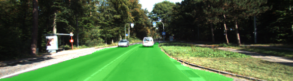

# Semantic Segmentation

### Introduction

The goal of this project is to construct a fully convolutional neural network based on the VGG-16 image classifier architecture for performing semantic segmentation to label the pixels of a road in images.

### Project [Rubric](https://review.udacity.com/#!/rubrics/989/view)

#### Build the Neural Network

1. Does the project load the pretrained vgg model?

   Yes, project is loading pretrained `VGG` model which can be found [here](https://s3-us-west-1.amazonaws.com/udacity-selfdrivingcar/vgg.zip).
   Implemented in `main.py` [line 21](https://github.com/jinay1991/CarND-Semantic-Segmentation/blob/master/main.py#L21)

2. Does the project learn the correct features from the images?

   Yes, project learns correct features from the images to segment road pixels correctly. Implemented in `main.py` [line 49](https://github.com/jinay1991/CarND-Semantic-Segmentation/blob/master/main.py#L49)

3. Does the project optimize the neural network?

   Yes, project uses Adams Optimizer for optimising and minimizing loss for the neural networks. Implemented in `main.py` [line 100](https://github.com/jinay1991/CarND-Semantic-Segmentation/blob/master/main.py#L100)

4. Does the project train the neural network?

   Yes, project trains neural network for KITTI Dataset for `epoch=25` with `batch_size=8`, `learning_rate=0.0001` and `l2_regularizer=1e-3`. After training for `25 epochs`, average loss was recorded to be `~0.035`. Implemneted in `main.py` [line 167](https://github.com/jinay1991/CarND-Semantic-Segmentation/blob/master/main.py#L167), [line 62](https://github.com/jinay1991/CarND-Semantic-Segmentation/blob/master/main.py#L62) and [line 147](https://github.com/jinay1991/CarND-Semantic-Segmentation/blob/master/main.py#L147).

   To train network I have used Google Cloud Compute Engine with 8 CPU, 52GB RAM and NVIDIA P100 configuration, which took ~5 mins for training for 25 epochs.

#### Neural Network Training

1. Does the project train the model correctly?

   Yes, model loss decreases with every epochs. Initial loss for model was `1.490` which was reduced to `0.079` after `12 epochs` and further reduced to `0.35` after `25 epochs`.

   Also, by looking at the resultant images, it performs segmentation of road pixels correctly.

   Below are the sample resultant images:

   
   
   
   

   Logs for training is available as [training.log](https://github.com/jinay1991/CarND-Semantic-Segmentation/blob/master/training.log).

2. Does the project use reasonable hyperparameters?

   Yes. Project uses following hyperparameters to correctly train a model.

    | Hyperparameter      | Value  |
    | ------------------- | ------ |
    | Batch Size          | 8      |
    | Epochs              | 25     |
    | L2 Regularization   | 1e-3   |
    | Standard Deviation  | 0.01   |
    | Learning Rate       | 0.0001 |
    | Dropout Probability | 0.5    |

3. Does the project correctly label the road?

   Yes. Project implements loading of correct label in `main.py` at [line 147](https://github.com/jinay1991/CarND-Semantic-Segmentation/blob/master/main.py#L147)

# Udacity provided README.md

### Introduction
In this project, you'll label the pixels of a road in images using a Fully Convolutional Network (FCN).

### Setup
##### GPU
`main.py` will check to make sure you are using GPU - if you don't have a GPU on your system, you can use AWS or another cloud computing platform.
##### Frameworks and Packages
Make sure you have the following is installed:
 - [Python 3](https://www.python.org/)
 - [TensorFlow](https://www.tensorflow.org/)
 - [NumPy](http://www.numpy.org/)
 - [SciPy](https://www.scipy.org/)
##### Dataset
Download the [Kitti Road dataset](http://www.cvlibs.net/datasets/kitti/eval_road.php) from [here](http://www.cvlibs.net/download.php?file=data_road.zip).  Extract the dataset in the `data` folder.  This will create the folder `data_road` with all the training a test images.

### Start
##### Implement
Implement the code in the `main.py` module indicated by the "TODO" comments.
The comments indicated with "OPTIONAL" tag are not required to complete.
##### Run
Run the following command to run the project:
```
python main.py
```
**Note** If running this in Jupyter Notebook system messages, such as those regarding test status, may appear in the terminal rather than the notebook.

### Submission
1. Ensure you've passed all the unit tests.
2. Ensure you pass all points on [the rubric](https://review.udacity.com/#!/rubrics/989/view).
3. Submit the following in a zip file.
 - `helper.py`
 - `main.py`
 - `project_tests.py`
 - Newest inference images from `runs` folder  (**all images from the most recent run**)

 ### Tips
- The link for the frozen `VGG16` model is hardcoded into `helper.py`.  The model can be found [here](https://s3-us-west-1.amazonaws.com/udacity-selfdrivingcar/vgg.zip).
- The model is not vanilla `VGG16`, but a fully convolutional version, which already contains the 1x1 convolutions to replace the fully connected layers. Please see this [post](https://s3-us-west-1.amazonaws.com/udacity-selfdrivingcar/forum_archive/Semantic_Segmentation_advice.pdf) for more information.  A summary of additional points, follow.
- The original FCN-8s was trained in stages. The authors later uploaded a version that was trained all at once to their GitHub repo.  The version in the GitHub repo has one important difference: The outputs of pooling layers 3 and 4 are scaled before they are fed into the 1x1 convolutions.  As a result, some students have found that the model learns much better with the scaling layers included. The model may not converge substantially faster, but may reach a higher IoU and accuracy.
- When adding l2-regularization, setting a regularizer in the arguments of the `tf.layers` is not enough. Regularization loss terms must be manually added to your loss function. otherwise regularization is not implemented.

### Using GitHub and Creating Effective READMEs
If you are unfamiliar with GitHub , Udacity has a brief [GitHub tutorial](http://blog.udacity.com/2015/06/a-beginners-git-github-tutorial.html) to get you started. Udacity also provides a more detailed free [course on git and GitHub](https://www.udacity.com/course/how-to-use-git-and-github--ud775).

To learn about REAMDE files and Markdown, Udacity provides a free [course on READMEs](https://www.udacity.com/courses/ud777), as well.

GitHub also provides a [tutorial](https://guides.github.com/features/mastering-markdown/) about creating Markdown files.
